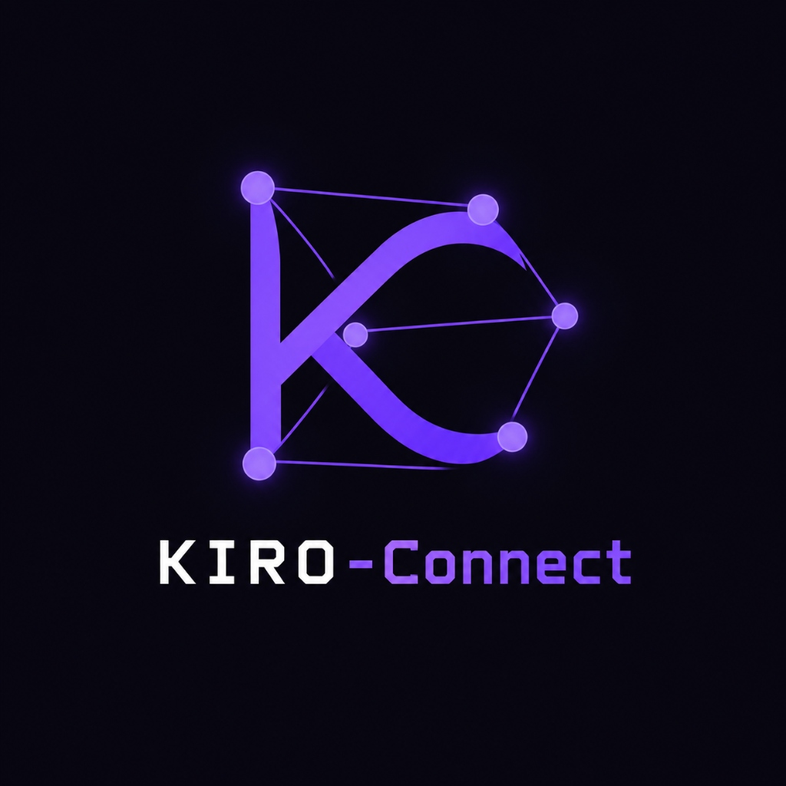
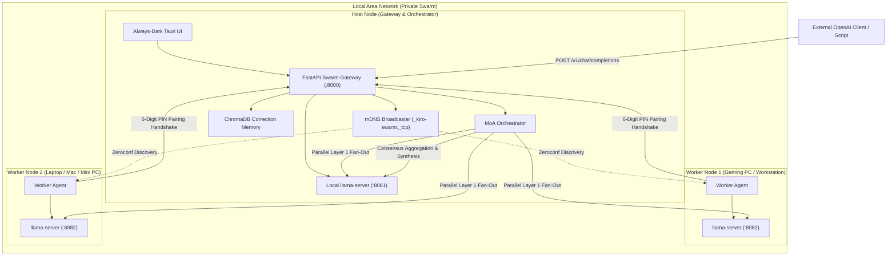

# KIRO-Connect: A Decentralized Peer-to-Peer Mixture-of-Agents Framework for Secure and Private Local LLM Inference over LAN

<div align="center">
  
  <br/><br/>

  [](https://opensource.org/licenses/MIT)
  [](https://www.microsoft.com/windows)
  [](https://tauri.app/)
  [](https://fastapi.tiangolo.com/)
  [](https://github.com/ggerganov/llama.cpp)
  [](https://www.trychroma.com/)

  <p><strong>Turn your local network into an elastic, private Mixture-of-Agents (MoA) LLM inference cluster.</strong></p>
</div>

---

## ⚡ Overview

**KIRO-Connect** is a zero-telemetry, decentralized peer-to-peer LLM clustering framework designed for private local area networks (LANs). It federates idle compute across household or office computers into an elastic **Mixture-of-Agents (MoA)** inference swarm.

Using **llama.cpp** as the underlying execution engine, **Zeroconf (mDNS)** for auto-discovery, **ChromaDB** for vector-grounded self-correction memory, and a secure **6-digit dynamic pairing PIN handshake**, KIRO-Connect enables enterprise-grade private reasoning without sending any prompt or weight data to external cloud providers.

---

## 📥 Windows Release Downloads

Pre-built binaries for 64-bit Windows are available from the official [GitHub Release v0.1.0](https://github.com/Rajaaditya-2207/KIRO-Connect/releases/tag/v0.1.0):

| Release Artifact | File Link | Size | Description |
| :--- | :--- | :--- | :--- |
| **Windows NSIS Installer** | [**`KIRO-Connect-Installer.exe`**](https://github.com/Rajaaditya-2207/KIRO-Connect/releases/download/v0.1.0/KIRO-Connect-Installer.exe) | `1.92 MB` | Standard Windows setup wizard with desktop shortcut & start menu entry. |
| **Standalone Portable EXE** | [**`KIRO-Connect.exe`**](https://github.com/Rajaaditya-2207/KIRO-Connect/releases/download/v0.1.0/KIRO-Connect.exe) | `4.78 MB` | Single-file portable desktop app built with Tauri v2. |

---

## 🏗️ Architecture & How It Works

KIRO-Connect operates in two symbiotic roles: **Host Swarm Gateway** and **Worker Nodes**.



### Core Architecture Highlights

1. **Mixture-of-Agents (MoA) Fan-Out:** Queries are dispatched in parallel to all active peers in Layer 1. Layer 2 then aggregates responses and feeds peer candidate proposals into a synthesis pass for high-fidelity consensus reasoning.
2. **Dynamic 6-Digit PIN Security:** Workers discover swarms automatically via mDNS but cannot join without entering the host's temporary 6-digit physical pairing code. Successful pairing issues a cryptographically secure session bearer token.
3. **Statistical Outlier Detection:** The orchestrator continuously calculates peer latency and token variance. Underperforming or misbehaving nodes are dynamically flagged with 1-click administrative reset controls.
4. **Correction Triples Memory (ChromaDB):** Real-time vector store indexing `(query, wrong_answer, correct_answer)` triples. When matching queries are detected, past corrections are automatically injected into the generation prompt as grounding context.
5. **Zero-Config llama.cpp Engine Manager:** Discovers installed `llama-server.exe` binaries across standard package locations (WinGet, AppData, PATH) and provides interactive GGUF model scanning.

---

## 🚀 Features

- **Decentralized LAN MoA:** Run models across multiple machines without cloud dependency.
- **OpenAI-Compatible Gateway:** Drop-in replacement for OpenAI API endpoints (`/v1/chat/completions`, `/v1/models`).
- **Zeroconf Auto-Discovery:** Peer discovery using `_kiro-swarm._tcp.local.` mDNS records.
- **Hardware Benchmarking:** Measure roundtrip latency, generation speed (tokens/sec), and peer divergence.
- **Native Windows Desktop UI:** Sleek, always-dark cyberpunk interface built with React, Vite, and Tauri v2.
- **Worker & Host Toggle:** Toggle any node between acting as the swarm master or a dedicated worker node.

---

## 🛠️ Quickstart

### Prerequisites
- Windows 10/11 (64-bit)
- Python 3.10+ (for backend orchestration)
- Node.js 18+ (for frontend development)
- [llama.cpp](https://github.com/ggerganov/llama.cpp) (`winget install ggerganov.llama.cpp` or placed in PATH)

### Option 1: Run Pre-built Executable
Download and run [`release/KIRO-Connect.exe`](release/KIRO-Connect.exe) or install with [`release/KIRO-Connect-Installer.exe`](release/KIRO-Connect-Installer.exe).

### Option 2: Run via PowerShell Script
Run the automated bootstrapper to set up virtual environment, dependencies, and start the gateway:
```powershell
./launch.ps1
```

### Option 3: Manual Startup
```powershell
# 1. Install Python dependencies
python -m venv .venv
.\.venv\Scripts\pip install -r requirements.txt

# 2. Build or run frontend
npm install
npm run build

# 3. Start Swarm Gateway
.\.venv\Scripts\python service/run_server.py --port 8000
```
Open `http://127.0.0.1:8000` in any web browser.

---

## 📡 API Usage

KIRO-Connect serves an OpenAI-compatible endpoint. Any OpenAI client or script can point directly to the swarm:

```python
import openai

client = openai.OpenAI(
    base_url="http://127.0.0.1:8000/v1",
    api_key="YOUR_HOST_API_KEY"  # Displayed on the Overview dashboard
)

response = client.chat.completions.create(
    model="kiro-moa-swarm",
    messages=[
        {"role": "user", "content": "Explain quantum entanglement in 2 sentences."}
    ]
)

print(response.choices[0].message.content)
```

---

## 🧪 Testing & Validation

A full suite of integration tests validates the engine, swarm endpoints, and outlier detection:
```powershell
.\.venv\Scripts\python scratch/test_integration.py
```

---

## 📄 License

This project is licensed under the [MIT License](LICENSE).
